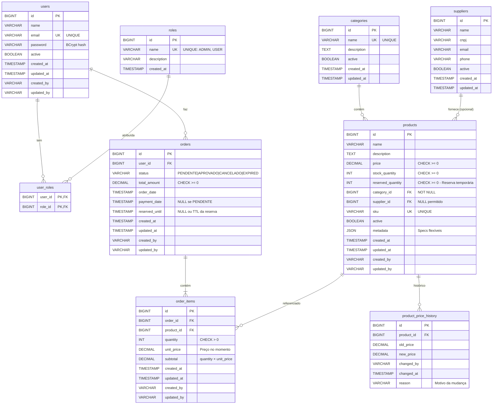

# Diagrama Entidade-Relacionamento - E-Commerce API

## 📊 Diagrama ER Completo (Mermaid)



---

## 📋 Legenda de Cardinalidades

| Notação | Significado | Exemplo |
|---------|-------------|---------|
| `||--o{` | Um para Muitos (1:N) | Um usuário faz vários pedidos |
| `}o--||` | Muitos para Um (N:1) | Vários produtos pertencem a uma categoria |
| `||--|{` | Um para Muitos Obrigatório | Um pedido TEM pelo menos 1 item |
| `||--o{` | Um para Muitos Opcional | Um fornecedor PODE ter 0 produtos |

---

## 🔗 Relacionamentos Detalhados

### **1. Autenticação (RBAC)**

```
users (1) ←→ (N) user_roles (N) ←→ (1) roles

Tipo: Many-to-Many (N:N)
Descrição: Um usuário pode ter múltiplas roles (ex: USER + ADMIN)
Cardinalidade: 
  - 1 user → 1 ou mais roles
  - 1 role → 0 ou mais users
Tabela Associativa: user_roles
```

**Exemplo**:
- João (user_id=2) → [USER]
- Admin (user_id=1) → [ADMIN, USER]

---

### **2. Catálogo - Categorias**

```
categories (1) → (N) products

Tipo: One-to-Many (1:N)
Descrição: Uma categoria contém vários produtos
Cardinalidade:
  - 1 category → 0 ou mais products
  - 1 product → exatamente 1 category
FK: products.category_id REFERENCES categories(id) NOT NULL
```

**Exemplo**:
- PERIFERICOS → [Mouse G203, Teclado HyperX, Headset Corsair]
- COMPONENTES → [Ryzen 5, RTX 3060, RAM 16GB]

---

### **3. Catálogo - Fornecedores**

```
suppliers (1) → (N) products

Tipo: One-to-Many (1:N) OPCIONAL
Descrição: Um fornecedor pode fornecer vários produtos
Cardinalidade:
  - 1 supplier → 0 ou mais products
  - 1 product → 0 ou 1 supplier (OPCIONAL!)
FK: products.supplier_id REFERENCES suppliers(id) NULL
```

**Exemplo**:
- Logitech → [Mouse G203, Webcam C920]
- Mouse Genérico → supplier_id = NULL ✅

**⚠️ IMPORTANTE**: `supplier_id` é **NULLABLE** porque:
1. Alguns produtos podem não ter fornecedor cadastrado
2. CRUD de suppliers não é requisito do case técnico
3. Demonstra normalização sem over-engineering

---

### **4. Pedidos - Usuários**

```
users (1) → (N) orders

Tipo: One-to-Many (1:N)
Descrição: Um usuário faz vários pedidos
Cardinalidade:
  - 1 user → 0 ou mais orders
  - 1 order → exatamente 1 user
FK: orders.user_id REFERENCES users(id) NOT NULL
```

**Exemplo**:
- João (id=2) → [Pedido #1, Pedido #5, Pedido #12]

---

### **5. Pedidos - Itens**

```
orders (1) → (N) order_items

Tipo: One-to-Many (1:N) OBRIGATÓRIO
Descrição: Um pedido DEVE ter pelo menos 1 item
Cardinalidade:
  - 1 order → 1 ou mais order_items (mínimo 1)
  - 1 order_item → exatamente 1 order
FK: order_items.order_id REFERENCES orders(id) ON DELETE CASCADE
```

**Exemplo**:
- Pedido #1 → [2x Mouse G203, 1x Teclado HyperX]

**⚠️ CASCADE**: Se deletar order → deleta todos order_items automaticamente

---

### **6. Produtos - Itens de Pedido**

```
products (1) → (N) order_items

Tipo: One-to-Many (1:N)
Descrição: Um produto pode aparecer em vários pedidos
Cardinalidade:
  - 1 product → 0 ou mais order_items
  - 1 order_item → exatamente 1 product
FK: order_items.product_id REFERENCES products(id)
```

**Exemplo**:
- Mouse G203 (id=1) → [Item do Pedido #1, Item do Pedido #5]

**💡 Design**: `order_items.unit_price` armazena preço no momento da compra (snapshot histórico)

---

### **7. Auditoria - Histórico de Preços**

```
products (1) → (N) product_price_history

Tipo: One-to-Many (1:N)
Descrição: Um produto pode ter vários registros de mudança de preço
Cardinalidade:
  - 1 product → 0 ou mais price_history
  - 1 price_history → exatamente 1 product
FK: product_price_history.product_id REFERENCES products(id)
```

**Exemplo**:
- Mouse G203 (id=1) → [
    - 01/10: R$ 179,90 → R$ 149,90 (promoção)
    - 15/11: R$ 149,90 → R$ 139,90 (Black Friday)
      ]

---

## 🔐 Controle de Estoque com Reserva Temporária (ADR-003)

### **Campo: products.reserved_quantity**

**Propósito**: Implementa a estratégia híbrida de reserva temporária + lock pessimista

**Funcionamento**:
```
disponivel = stock_quantity - reserved_quantity
```

**Quando é atualizado**:
1. **Checkout** → Incrementa `reserved_quantity`
2. **Pagamento aprovado** → Decrementa `stock_quantity` E `reserved_quantity`
3. **Reserva expirada** → Decrementa `reserved_quantity` (job scheduled)

**Exemplo prático**:
```sql
-- Estado inicial
stock_quantity = 10
reserved_quantity = 0
disponivel = 10

-- Cliente A inicia checkout (3 unidades)
reserved_quantity = 3
disponivel = 7

-- Cliente B inicia checkout (4 unidades)
reserved_quantity = 7
disponivel = 3

-- Cliente A paga (aprova)
stock_quantity = 7
reserved_quantity = 4
disponivel = 3

-- Cliente B desiste (TTL expira após 10min)
reserved_quantity = 0
disponivel = 7
```

### **Campo: orders.reserved_until**

**Propósito**: TTL (Time To Live) da reserva de estoque

**Valores possíveis**:
- `NULL` → Pedido sem reserva ativa (APROVADO, CANCELADO, EXPIRED)
- `TIMESTAMP` → Limite para pagamento (PENDENTE com reserva ativa)

**Gestão automatizada**:
```java
@Scheduled(fixedRate = 60000) // A cada 1 minuto
public void expireReservations() {
    List<Order> expired = orderRepo.findByStatusAndReservedUntilBefore(
        OrderStatus.PENDENTE, 
        LocalDateTime.now()
    );
    
    for (Order order : expired) {
        // Devolver estoque
        for (OrderItem item : order.getItems()) {
            Product p = productRepo.findById(item.getProductId());
            p.setReservedQuantity(p.getReservedQuantity() - item.getQuantity());
        }
        
        order.setStatus(OrderStatus.EXPIRED);
    }
}
```

### **Status: EXPIRED**

**Quando é usado**: Pedidos PENDENTES que ultrapassaram o TTL sem pagamento

**Diferença de CANCELADO**:
- `CANCELADO` → Usuário ou admin cancelou manualmente
- `EXPIRED` → Sistema expirou automaticamente (job scheduled)

---

## 🎯 Índices Otimizados

### Autenticação
```sql
INDEX idx_users_email (email)           -- Login rápido
INDEX idx_users_active (active)         -- Filtrar ativos
INDEX idx_user_roles_user (user_id)     -- Buscar roles do user
INDEX idx_user_roles_role (role_id)     -- Buscar users com role
```

### Catálogo
```sql
INDEX idx_products_category (category_id)  -- Filtrar por categoria
INDEX idx_products_supplier (supplier_id)  -- Filtrar por fornecedor
INDEX idx_products_sku (sku)               -- Busca por SKU
INDEX idx_products_active (active)         -- Filtrar ativos
```

### Pedidos
```sql
INDEX idx_orders_user_id (user_id)         -- Pedidos do usuário
INDEX idx_orders_status (status)           -- Filtrar por status
INDEX idx_orders_date (order_date)         -- Relatórios por período
INDEX idx_orders_reserved_until (reserved_until) -- Job de expiração ← NOVO
INDEX idx_order_items_order (order_id)     -- Itens do pedido
INDEX idx_order_items_product (product_id) -- Histórico de vendas
```

### Auditoria
```sql
INDEX idx_product_price_product (product_id) -- Histórico de preço
INDEX idx_product_price_date (changed_at)    -- Mudanças por período
```

---

## 🔒 Constraints e Validações

### Check Constraints
```sql
-- Produtos
CONSTRAINT chk_price_positive CHECK (price >= 0)
CONSTRAINT chk_stock_nonnegative CHECK (stock_quantity >= 0)
CONSTRAINT chk_reserved_nonnegative CHECK (reserved_quantity >= 0) ← NOVO

-- Pedidos
CONSTRAINT chk_total_positive CHECK (total_amount >= 0)
CONSTRAINT chk_status_valid CHECK (status IN ('PENDENTE', 'APROVADO', 'CANCELADO', 'EXPIRED')) ← ATUALIZADO

-- Itens de Pedido
CONSTRAINT chk_quantity_positive CHECK (quantity > 0)
CONSTRAINT chk_unit_price_positive CHECK (unit_price >= 0)
CONSTRAINT chk_subtotal_positive CHECK (subtotal >= 0)
```

### Unique Constraints
```sql
users.email          -- Email único por usuário
products.sku         -- SKU único por produto
categories.name      -- Nome único de categoria
roles.name           -- Nome único de role
```

### Foreign Keys
```sql
-- ON DELETE CASCADE: Deletar order → deleta order_items
order_items.order_id REFERENCES orders(id) ON DELETE CASCADE

-- ON DELETE CASCADE: Deletar user → deleta user_roles
user_roles.user_id REFERENCES users(id) ON DELETE CASCADE

-- Demais FKs: Comportamento padrão (RESTRICT)
```

---

## 📊 Normalização

**Forma Normal**: 3NF (Terceira Forma Normal)

### Justificativa:

1. **1NF** ✅ - Valores atômicos (sem listas em colunas)
2. **2NF** ✅ - Sem dependências parciais (todas PKs são simples ou compostas corretamente)
3. **3NF** ✅ - Sem dependências transitivas:
    - Categories separado de Products
    - Suppliers separado de Products
    - Roles separado de Users (N:N)

### Exceção: JSON Metadata

`products.metadata` viola 1NF tecnicamente, mas é **intencional**:
- ✅ Especificações flexíveis por produto
- ✅ Evita schema rígido (EAV seria muito complexo)
- ✅ MySQL 8.0 suporta queries JSON nativas

---

## 🎓 Decisões Arquiteturais

### 1. **Supplier Opcional**
```sql
products.supplier_id BIGINT NULL
```
**Por quê**: CRUD de suppliers não é requisito. Demonstra normalização sem over-engineering.

---

### 2. **Unit Price em Order Items**
```sql
order_items.unit_price DECIMAL(10,2)
```
**Por quê**: Snapshot histórico. Se preço do produto mudar, pedidos antigos mantêm preço original.

---

### 3. **Payment Date Nullable**
```sql
orders.payment_date TIMESTAMP NULL
```
**Por quê**: NULL = pedido PENDENTE. Populated = pedido APROVADO.

---

### 4. **Auditoria Seletiva**
Apenas `product_price_history` implementado.

**Por quê**: Ver **ADR-004** - mudanças de preço são manuais e têm valor analítico real.

---

### 5. **Controle de Estoque com Reserva Temporária** ⭐ NOVO

**Campos adicionados**:
- `products.reserved_quantity` - Estoque reservado temporariamente
- `orders.reserved_until` - TTL da reserva (10 minutos)
- `orders.status` - Adicionado valor `EXPIRED`

**Por quê**: Ver **ADR-003** - Estratégia híbrida que combina:
1. Reserva temporária no checkout (melhor UX)
2. Lock pessimista no pagamento (garante consistência)
3. Job scheduled para expiração (libera estoque automaticamente)

**Vantagens**:
- ✅ Cliente sabe disponibilidade real no checkout
- ✅ Pode ajustar quantidade antes de pagar
- ✅ Reserva garante produto durante pagamento (10min)
- ✅ Expira automaticamente se abandonar

---

## 📚 Documentação Relacionada

- **ADR-001**: Arquitetura Modular Monolítica
- **ADR-003**: Locks Pessimistas + Reserva Temporária ⭐
- **ADR-004**: Auditoria Seletiva + Escopo de CRUD
- **database-README.md**: Instruções de importação e credenciais

---

**Versão**: 1.1  
**Última Atualização**: 07/11/2025  
**Responsável**: Danrley Brasil dos Santos  
**Alterações**: Adicionado controle de reserva temporária (ADR-003)