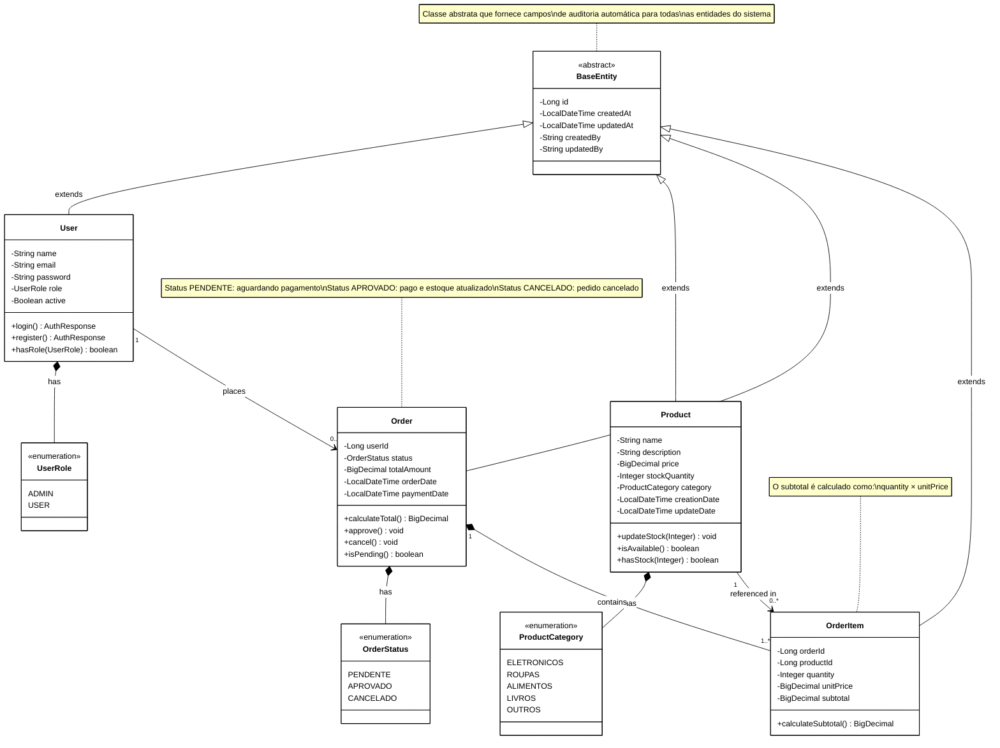

# Diagrama de Classes - E-Commerce API

## 📋 Visão Geral

Este diagrama representa o modelo de domínio da aplicação e-commerce, mostrando as entidades principais, seus relacionamentos e a estrutura de herança com auditoria automática.

## 🏗️ Arquitetura do Domínio



## 🔗 Descrição dos Relacionamentos

### **Herança (Auditoria)**
Todas as entidades herdam de `BaseEntity`, garantindo rastreabilidade:
- `createdAt` / `updatedAt`: timestamps automáticos
- `createdBy` / `updatedBy`: auditoria de usuários

### **User ↔ Order** (1:N)
- Um usuário pode ter **zero ou vários pedidos**
- Cada pedido pertence a **exatamente um usuário**
- Relacionamento: `User.id → Order.userId`

### **Order ↔ OrderItem** (1:N - Composição)
- Um pedido **deve ter no mínimo 1 item**
- Itens não existem sem o pedido (composição forte)
- Relacionamento: `Order.id → OrderItem.orderId`

### **Product ↔ OrderItem** (1:N)
- Um produto pode estar em **vários pedidos**
- Cada item referencia **exatamente um produto**
- Relacionamento: `Product.id → OrderItem.productId`

## 🎯 Pontos de Atenção Arquiteturais

### **1. Normalização de Dados**
- `OrderItem` armazena `unitPrice` no momento da compra
- **Motivo**: histórico de preços (Product.price pode mudar)

### **2. Integridade Transacional**
- Status `PENDENTE` → `APROVADO` requer:
    - Validação de estoque
    - Atualização de `Product.stockQuantity` (lock pessimista)
    - Registro de `Order.paymentDate`

### **3. Regras de Negócio**
```
CRIAR PEDIDO:
1. Validar estoque de TODOS os produtos
2. Se OK → criar Order (status PENDENTE)
3. Retornar Order.id para pagamento

PROCESSAR PAGAMENTO:
4. Buscar Order (status PENDENTE)
5. Aplicar lock pessimista nos Products
6. Atualizar estoque (quantity - ordered)
7. Mudar status → APROVADO
8. Commit da transação
```

## 📊 Métricas do Modelo

| Métrica | Valor |
|---------|-------|
| Total de Entidades | 4 |
| Total de Enums | 3 |
| Relacionamentos | 3 principais |
| Nível de Normalização | 3NF |

## 🔄 Evolução Futura

Este modelo está preparado para:
- ✅ Adicionar `Payment` como entidade separada
- ✅ Extrair `Address` para entregas
- ✅ Criar `ProductReview` para avaliações
- ✅ Separar em microserviços (ver `evolucao-microservices.md`)

---

**Última Atualização**: 04/11/2025  
**Versão**: 1.0  
**Responsável**: Danrley Brasil dos Santos