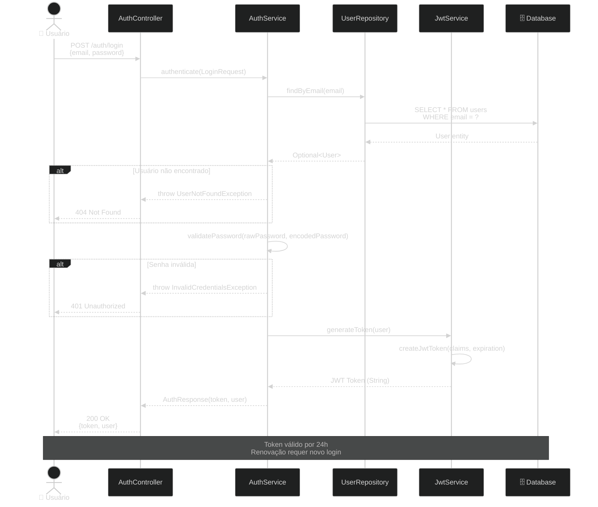
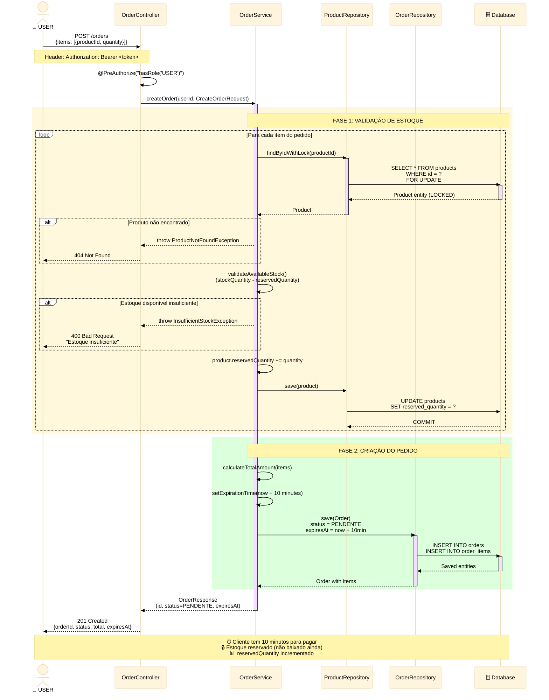
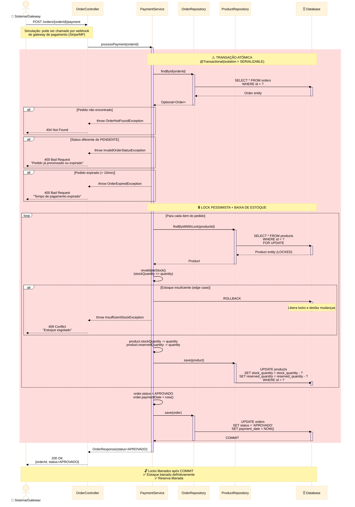
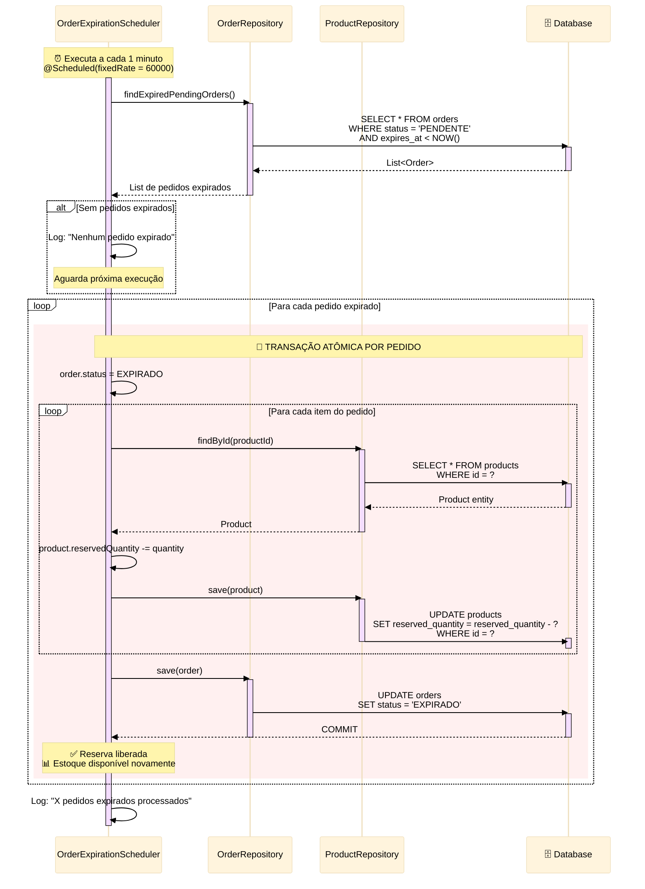
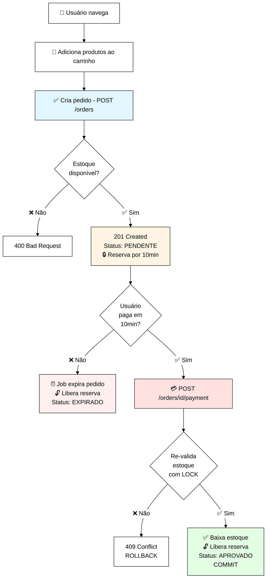

# Diagrama de Sequência - E-Commerce API

## 📋 Visão Geral

Este documento apresenta os fluxos sequenciais críticos da aplicação, demonstrando a estratégia híbrida de controle de estoque implementada: **Reserva Temporária + Lock Pessimista**.

## 🎯 Fluxos Documentados

1. **Autenticação JWT** - Login de usuário
2. **Criação de Pedido** - Reserva temporária de estoque (TTL 10min)
3. **Processamento de Pagamento** - Lock pessimista + baixa definitiva
4. **Expiração Automática** - Job scheduled que libera reservas

---

## 🔐 Fluxo 1: Autenticação JWT

### Cenário: Login de usuário



### Pontos-Chave
- ✅ Validação em duas etapas (usuário existe + senha correta)
- ✅ Token JWT com expiração de 24h
- ✅ Tratamento de erros específicos (404 vs 401)

---

## 🛒 Fluxo 2: Criação de Pedido com Reserva Temporária

### Cenário: Usuário cria pedido e sistema reserva estoque por 10 minutos



### Pontos-Chave
- ✅ **Lock Pessimista** (`FOR UPDATE`) durante validação para evitar race condition
- ✅ Validação de estoque **disponível**: `stockQuantity - reservedQuantity`
- ✅ **Reserva temporária**: incrementa `reservedQuantity` sem baixar `stockQuantity`
- ✅ **TTL de 10 minutos**: campo `expiresAt` no pedido
- ✅ Status inicial: `PENDENTE`
- ⚠️ Estoque NÃO é baixado ainda (só reservado)

### Por que Reserva Temporária?

| Abordagem | Prós | Contras |
|-----------|------|---------|
| **Baixar na criação** | Simples | Muitos abandonos = estoque travado |
| **Baixar só no pagamento** | Máxima disponibilidade | Race condition severa |
| **Reserva + Lock (escolhida)** ✅ | UX + Consistência | Complexidade adicional |

---

## 💳 Fluxo 3: Processamento de Pagamento (Automático)

### Cenário: Sistema processa pagamento com lock pessimista e baixa definitiva



### Pontos-Chave Críticos

#### 🔒 Lock Pessimista (`FOR UPDATE`)
```sql
SELECT * FROM products 
WHERE id = ? 
FOR UPDATE;
```
- Previne race conditions durante o pagamento
- Outros pagamentos **aguardam** liberação do lock
- Garante consistência absoluta do estoque

#### ⚠️ Re-validação de Estoque

**Por que re-validar se já reservamos?**

Cenário Edge Case:
```
T=0:  Pedido A criado (reserva 5 unidades, expira T+10min)
T=9:  Job de expiração não rodou ainda
T=9:  Pedido B criado (vê 0 disponível, falha) ✅
T=10: Pedido A tenta pagar (já expirou!)
```

**Solução Implementada**:
1. Lock pessimista no pagamento
2. **Re-validação** de estoque dentro da transação
3. Verificação de expiração do pedido
4. Rollback automático se inconsistência detectada

#### 🎯 Isolamento SERIALIZABLE

```java
@Transactional(isolation = Isolation.SERIALIZABLE)
```
- Mais alto nível de isolamento
- Garante consistência total
- Trade-off: performance (aceitável para pagamentos críticos)

---

## ⏰ Fluxo 4: Expiração Automática de Pedidos

### Cenário: Job scheduled libera reservas de pedidos expirados



### Pontos-Chave
- ✅ Execução **automática** a cada 1 minuto
- ✅ Busca pedidos com `status = PENDENTE` e `expiresAt < NOW()`
- ✅ **Libera reservas**: decrementa `reservedQuantity`
- ✅ Atualiza status para `EXPIRADO`
- ✅ Transação atômica por pedido (se um falhar, outros continuam)
- ⚠️ Não usa lock pessimista (performance > consistência neste caso)

### Por que Job Scheduled?

| Alternativa | Contras |
|-------------|---------|
| **Manual** | Requer ação humana |
| **Trigger SQL** | Complexidade de debug |
| **Job Scheduled** ✅ | Simples, testável, monitorável |

---

## 🔄 Fluxo Completo End-to-End



---

## 📊 Comparação de Abordagens

### Lock Pessimista vs Lock Otimista

| Aspecto | Pessimista ✅ | Otimista |
|---------|--------------|----------|
| **Quando usar** | Alta concorrência<br/>Dados críticos | Baixa concorrência<br/>Leitura > Escrita |
| **Mecanismo** | `FOR UPDATE` | `@Version` |
| **Performance** | Mais lento | Mais rápido |
| **Consistência** | Garantida | Retry necessário |
| **Nosso caso** | **ESCOLHIDO**<br/>Estoque é crítico | Não adequado |

### Por que Lock Pessimista para Estoque?

✅ **Argumentos a Favor**:
- Estoque é um recurso finito e crítico
- Race conditions causam vendas impossíveis (overselling)
- UX: melhor travar 2s que vender sem estoque

❌ **Argumentos Contra** (mitigados):
- Performance: poucos pagamentos simultâneos no mesmo produto (aceitável)
- Deadlocks: locks curtos e ordenados por productId

---

## 🎓 Lições Aprendidas e Decisões

### 1. Por que Reserva Temporária + Lock Pessimista?

**Problema sem reserva**:
```
Cliente A: adiciona 5 produtos ao carrinho
Cliente B: adiciona 3 produtos ao carrinho
Estoque: 5 unidades

Se B paga primeiro → OK (sobra 2)
Se A tenta pagar → FALHA ❌ (frustrante!)
```

**Solução com reserva**:
- Cliente sabe disponibilidade real no checkout
- Pode ajustar quantidade antes de pagar
  - ⚠️ Seria interessante criar uma rotina de verificação do estoque dos itens do pedido talvez em rotinas como "Calculo de Entrega", ou algum botão/rotina para atualizar a quantidade disponível dentro do carrinho.
- Reserva expira se não pagar (estoque volta)

### 2. Por que NÃO usar Event Sourcing?

- ✅ Complexidade desnecessária para o escopo
- ✅ MySQL + Transações ACID são suficientes
- ⚠️ Evolução futura: considerar para auditoria completa

### 3. Por que Processamento Automático de Pagamento?

**Implementação atual**: Endpoint simulado `/orders/{id}/payment`

**Produção real**:
- Integração com gateway (Stripe/Mercado Pago/PagSeguro)
- Webhook recebe confirmação de pagamento
- Sistema processa automaticamente
- ⚠️ Ver ADR-002 para detalhes de integração futura

### 4. Por que NÃO usar filas (RabbitMQ)?

- ✅ Síncrono é mais simples e adequado ao case
- ✅ Filas para casos de uso assíncronos (email, notificações)

---

## 📈 Métricas de Complexidade

| Fluxo | Atores | Camadas | Validações | Locks | Transações |
|-------|--------|---------|-----------|-------|------------|
| Login | 1 | 4 | 2 | 0 | 0 |
| Criar Pedido | 1 | 4 | N×2 | N | 1 |
| Processar Pagamento | 1 | 4 | N×2 | N | 1 |
| Expirar Pedidos | 0 (scheduled) | 3 | 0 | 0 | N |

**N** = número de itens no pedido

---

## 🔗 Referências

- [ADR-003: Locks Pessimistas + Reserva Temporária](../decisions/ADR-003-locks-pessimistas.md)

---

**Última Atualização**: 10/11/2025  
**Versão**: 2.0  
**Responsável**: Danrley Brasil dos Santos