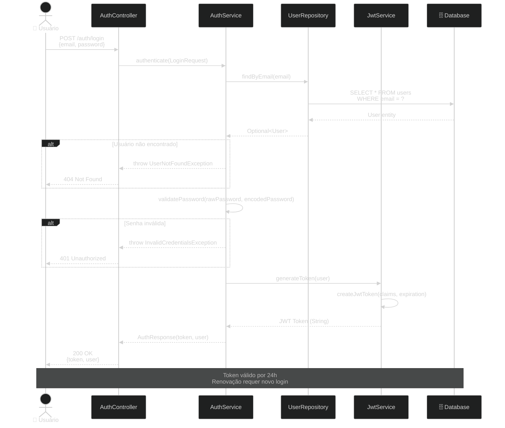
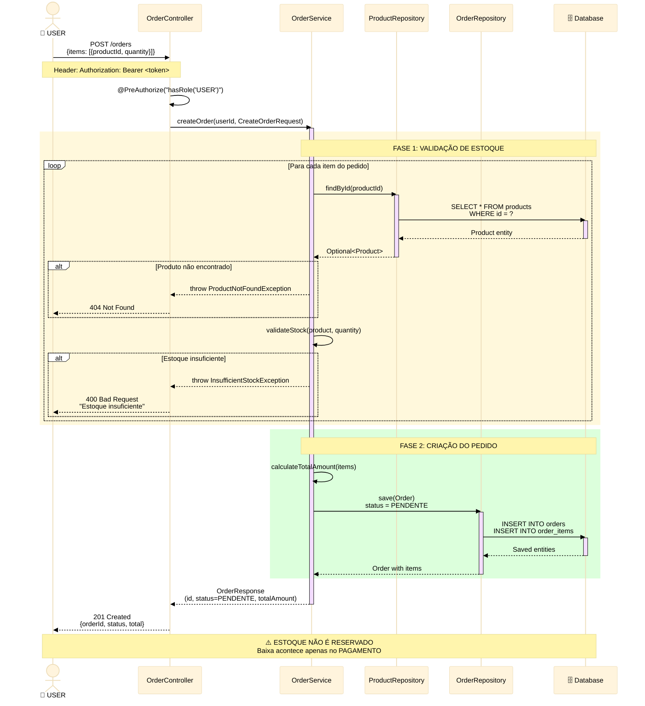
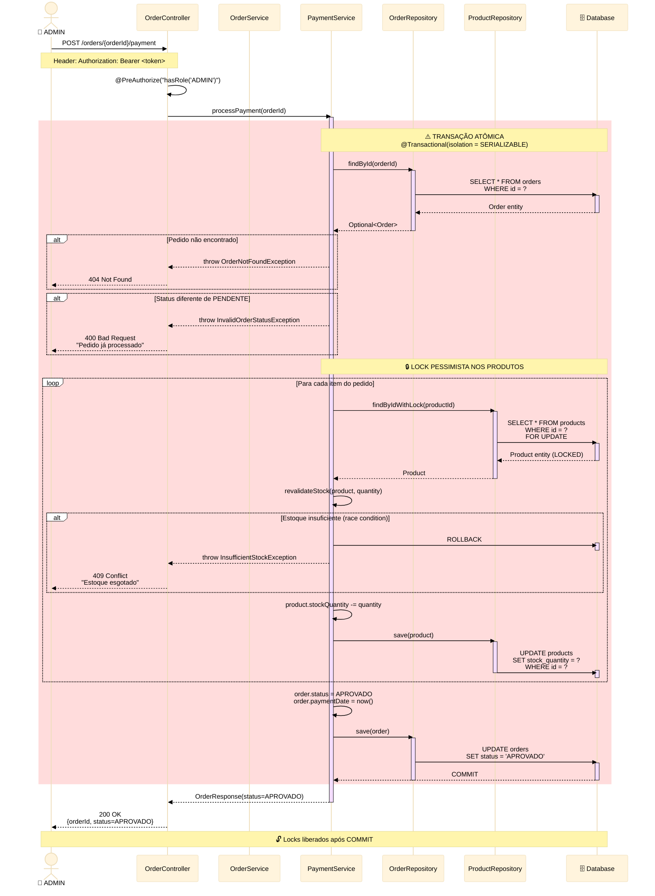
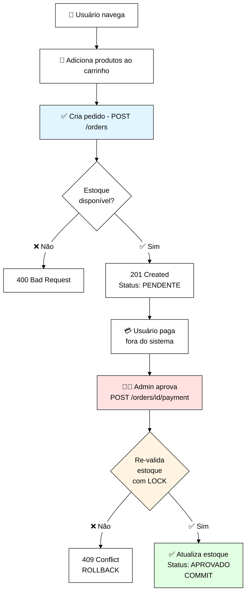

# Diagrama de Sequência - E-Commerce API

## 📋 Visão Geral

Este documento apresenta os fluxos sequenciais mais críticos da aplicação, demonstrando a interação entre as camadas e as decisões de negócio implementadas.

## 🎯 Fluxos Documentados

1. **Autenticação JWT** - Login de usuário
   2. **Criação de Pedido** - Validação de estoque e criação (crítico)
   3. **Processamento de Pagamento** - Aprovação com locks pessimistas (crítico)

---

## 🔐 Fluxo 1: Autenticação JWT

### Cenário: Login de usuário



### Pontos-Chave
- ✅ Validação em duas etapas (usuário existe + senha correta)
  - ✅ Token JWT com expiração de 24h
  - ✅ Tratamento de erros específicos (404 vs 401)

---

## 🛒 Fluxo 2: Criação de Pedido (Crítico)

### Cenário: Usuário cria pedido com validação de estoque



### Pontos-Chave
- ✅ Validação de **TODOS** os produtos antes de criar
  - ✅ Cálculo de `totalAmount` na criação
  - ⚠️ Estoque é apenas **verificado**, não reservado
  - ✅ Status inicial: `PENDENTE`

### Por que não reservar estoque na criação?

| Abordagem | Prós | Contras |
|-----------|------|---------|
| **Reservar na criação** | Garante disponibilidade | Muitos pedidos abandonados<br/>Estoque "travado" |
| **Baixar no pagamento** ✅ | Maximiza vendas<br/>Sem estoque parado | Race condition no pagamento |

**Decisão**: Baixar no pagamento + **Lock Pessimista** (ver fluxo 3)

---

## 💳 Fluxo 3: Processamento de Pagamento (Crítico + Concorrência)

### Cenário: Pagamento de pedido com atualização de estoque



### Pontos-Chave Críticos

#### 🔒 Lock Pessimista (`FOR UPDATE`)
```sql
SELECT * FROM products 
WHERE id = ? 
FOR UPDATE;
```
- Previne race conditions
  - Outros pagamentos **aguardam** liberação do lock
  - Garante consistência do estoque

#### ⚠️ Tratamento de Race Condition

**Cenário Problemático**:
```
T=0: Pedido A criado (valida estoque = 5 OK)
T=1: Pedido B criado (valida estoque = 5 OK)
T=2: Pagamento A processa (estoque -= 5 = 0)
T=3: Pagamento B tenta processar (estoque = 0)
```

**Solução Implementada**:
1. Lock pessimista no pagamento
   2. **Re-validação** de estoque dentro da transação
   3. Rollback automático se inconsistência detectada

#### 🎯 Isolamento SERIALIZABLE

```java
@Transactional(isolation = Isolation.SERIALIZABLE)
```
- Mais alto nível de isolamento
  - Garante consistência total
  - Trade-off: performance (aceito para pagamentos)

---

## 📊 Comparação de Abordagens

### Lock Pessimista vs Lock Otimista

| Aspecto | Pessimista ✅ | Otimista |
|---------|--------------|----------|
| **Quando usar** | Alta concorrência<br/>Dados críticos | Baixa concorrência<br/>Leitura > Escrita |
| **Mecanismo** | `FOR UPDATE` | `@Version` |
| **Performance** | Mais lento | Mais rápido |
| **Consistência** | Garantida | Retry necessário |
| **Nosso caso** | **ESCOLHIDO**<br/>Estoque é crítico | Não adequado |

### Por que Lock Pessimista para Estoque?

✅ **Argumentos a Favor**:
- Estoque é um recurso finito e crítico
  - Race conditions causam vendas impossíveis
  - UX: melhor travar 2s que vender sem estoque

❌ **Argumentos Contra** (mitigados):
- Performance: poucos pagamentos simultâneos (aceitável)
  - Deadlocks: locks curtos e ordenados por productId

---

## 🔄 Fluxo Completo End-to-End



---

## 🎓 Lições Aprendidas e Decisões

### 1. **Por que não usar Event Sourcing?**
- ✅ Complexidade desnecessária para o escopo
  - ✅ MySQL + Transações ACID são suficientes
  - ⚠️ Evolução futura: considerar para auditoria

### 2. **Por que ADMIN aprova pagamento?**
- ✅ Simulação simplificada (sem gateway de pagamento)
  - ✅ Permite testar fluxo completo
  - ⚠️ Produção: integrar com Stripe/Mercado Pago

### 3. **Por que não usar filas (RabbitMQ)?**
- ✅ Síncrono é mais simples e adequado ao case
  - ✅ Filas para casos de uso assíncronos (email, notificações)
  - ⚠️ Evolução: ver `evolucao-microservices.md`

---

## 📈 Métricas de Complexidade

| Fluxo | Atores | Camadas | Validações | Locks | Transações |
|-------|--------|---------|------------|-------|------------|
| Login | 1 | 4 | 2 | 0 | 0 |
| Criar Pedido | 1 | 4 | N×2 | 0 | 1 |
| Processar Pagamento | 1 | 5 | N×2 | N | 1 |

**N** = número de itens no pedido

---

## 🔗 Referências

- [Pessimistic Locking - Spring Data JPA](https://docs.spring.io/spring-data/jpa/docs/current/reference/html/#jpa.locking)
  - [Transaction Isolation Levels](https://en.wikipedia.org/wiki/Isolation_(database_systems))
  - [Patterns of Enterprise Application Architecture - Martin Fowler](https://martinfowler.com/eaaCatalog/)

---

**Última Atualização**: 04/11/2025  
**Versão**: 1.0  
**Responsável**: Danrley Brasil dos Santos